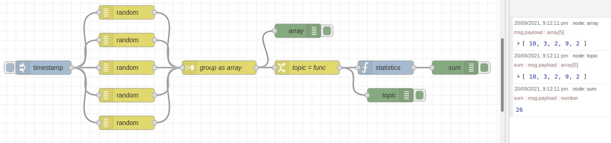

# Node Red Statistics

Calculates statistics about input data. This is a wrapper around the [Simple Statistics](http://simplestatistics.org) Node library.

## Inputs

Normally, the value of an input property is saved into the data set. The
`input property` may also contain an array of values which will be saved into the
data set.  If `data set size` is greater that 0 then the size of the data set will be
limited to the number of elements specified, with the oldest elements dropped first.

When a message is received with a [MQTT format](http://public.dhe.ibm.com/software/dw/webservices/ws-mqtt/mqtt-v3r1.html#appendix-a) topic that ends with a sub-topic that is a statistical function name, that statistic is calculated and output to the output property. For example, a message with the topic `data/mean` would output the mean of the data received so far. Optionally, the function name can be stripped from the topic. For statistical functions that require a parameter, the parameter is passed in using the parameter property.

## Example

To get started, you can try this simple example to sum an array of random values:

1. Create an `[inject]` node to trigger 5 `[random]` nodes, and feed them into a single `[group]` node.
2. Configure the `[group]` node to use `mode: manual` and `to create: an Array`. This will combine the 5 values into a single list. e.g. `[1,6,9,3,4]`
3. Connect the output of the `[group]` into a `[change]` node that sets `msg.topic` to the name of the desired function. e.g `sum`
4. The join the output of the `[change]` node to the input of the `[statistics]` node. Done!

See the list below for available functions, and simply swap `sum` in the `[change]` node for your desired function.





<details>
  <summary>Example flow JSON</summary>
  
```
[{"id":"8d4280c37c03c87e","type":"random","z":"6e9bd01e4dd4151c","name":"","low":1,"high":10,"inte":"true","property":"payload","x":320,"y":480,"wires":[["f9a79f6ff95fae39"]]},{"id":"8e904295ce59ee22","type":"random","z":"6e9bd01e4dd4151c","name":"","low":1,"high":10,"inte":"true","property":"payload","x":320,"y":540,"wires":[["f9a79f6ff95fae39"]]},{"id":"de285d90997217a6","type":"random","z":"6e9bd01e4dd4151c","name":"","low":1,"high":10,"inte":"true","property":"payload","x":320,"y":600,"wires":[["f9a79f6ff95fae39"]]},{"id":"e8376ba4eb785bf0","type":"random","z":"6e9bd01e4dd4151c","name":"","low":1,"high":10,"inte":"true","property":"payload","x":320,"y":660,"wires":[["f9a79f6ff95fae39"]]},{"id":"8bc54d0c1f4dbe21","type":"random","z":"6e9bd01e4dd4151c","name":"","low":1,"high":10,"inte":"true","property":"payload","x":320,"y":720,"wires":[["f9a79f6ff95fae39"]]},{"id":"f9a79f6ff95fae39","type":"join","z":"6e9bd01e4dd4151c","name":"group as array","mode":"custom","build":"array","property":"payload","propertyType":"msg","key":"topic","joiner":"\\n","joinerType":"str","accumulate":false,"timeout":"1","count":"5","reduceRight":false,"reduceExp":"","reduceInit":"","reduceInitType":"","reduceFixup":"","x":520,"y":600,"wires":[["047d451cce9ed7d8","6dd2fb91cb428b13"]]},{"id":"c0bfacd6fd65a955","type":"statistics","z":"6e9bd01e4dd4151c","name":"","dataSetSize":"5","inputField":"payload","inputFieldType":"msg","resultField":"payload","resultFieldType":"msg","parameterField":"","parameterFieldType":"msg","stripFunction":false,"resultOnly":true,"x":880,"y":600,"wires":[["f7983de9d1cf3cdf"]]},{"id":"047d451cce9ed7d8","type":"change","z":"6e9bd01e4dd4151c","name":"topic = func","rules":[{"t":"set","p":"topic","pt":"msg","to":"sum","tot":"str"}],"action":"","property":"","from":"","to":"","reg":false,"x":710,"y":600,"wires":[["c0bfacd6fd65a955","e18cf0c8b0839c82"]]},{"id":"a106fa3c4574afcc","type":"inject","z":"6e9bd01e4dd4151c","name":"","props":[{"p":"payload"},{"p":"topic","vt":"str"}],"repeat":"","crontab":"","once":false,"onceDelay":0.1,"topic":"","payload":"","payloadType":"date","x":140,"y":600,"wires":[["8d4280c37c03c87e","8e904295ce59ee22","de285d90997217a6","e8376ba4eb785bf0","8bc54d0c1f4dbe21"]]},{"id":"f7983de9d1cf3cdf","type":"debug","z":"6e9bd01e4dd4151c","name":"sum","active":true,"tosidebar":true,"console":false,"tostatus":false,"complete":"payload","targetType":"msg","statusVal":"","statusType":"auto","x":1030,"y":600,"wires":[]},{"id":"6dd2fb91cb428b13","type":"debug","z":"6e9bd01e4dd4151c","name":"array","active":true,"tosidebar":true,"console":false,"tostatus":false,"complete":"payload","targetType":"msg","statusVal":"","statusType":"auto","x":690,"y":520,"wires":[]},{"id":"e18cf0c8b0839c82","type":"debug","z":"6e9bd01e4dd4151c","name":"topic","active":true,"tosidebar":true,"console":false,"tostatus":false,"complete":"payload","targetType":"msg","statusVal":"","statusType":"auto","x":890,"y":660,"wires":[]}]
```

</details>


## Functions

The functions in the Simple Statistics library that are supported are:

- bernoulliDistribution
- chunk
- ckmeans
- cumulativeStdNormalProbability
- equalIntervalBreaks
- errorFunction
- extent
- factorial
- inverseErrorFunction
- gamma
- geometricMean
- harmonicMean
- interquartileRange
- medianAbsoluteDeviation
- max
- mean
- median
- min
- mode
- poissonDistribution
- probit
- product
- quantile
- quantileRank
- rootMeanSquare
- sample
- sampleWithReplacement
- sampleKurtosis
- sampleSkewness
- sampleStandardDeviation
- shuffle
- standardDeviation
- sum
- sumNthPowerDeviations
- tTest
- uniqueCount
- variance

In addition, three other functions are implemented:

- size - returns the size of the data set
- clear - clears the data set
- dump - dumps the data set in an array

These three functions can also contain a data item or array of data items which are added to the data set before calculating the result for `size` or `dump`, or after the data set is cleared for `clear`.

For more detailed information about the functions see the [Simple Statistics API documentation](http://simplestatistics.org/docs/).


